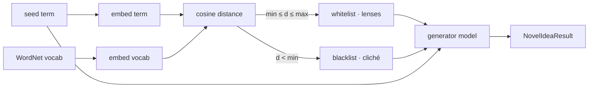

# Novel Idea Generator

> Break an LLM out of its own prior. Generate genuinely *non-obvious* concepts by
> deriving candidate ideas from embedding geometry over an external lexical
> database — not from autoregressive token prediction.

[](LICENSE)
[](https://www.python.org/)

---

## Why this exists

A large language model that calls itself for "new ideas" is trapped inside its
own prior. Ask it for ideas about *umbrella* and it returns rain, shade, and
parasols — the statistically obvious associations baked into its weights. The
loop never escapes the cliché basin.

This tool breaks that loop with a simple, transparent mechanism:

1. **Source candidates from outside the model.** Concepts come from the
   [WordNet](https://wordnet.princeton.edu/) lexical database (≈80k nouns),
   downloaded on demand. **Nothing is hard-coded.**
2. **Use geometry, not generation, to pick lenses.** Embed the seed term and the
   whole vocabulary with a sentence-transformer, then rank every concept by
   cosine *distance* (`1 − similarity`) to the term.
3. **Split the vocabulary into two bands:**
   - **blacklist** — concepts *closer* than `min_distance`: the cliché, "of
     course" neighbours. These are **forbidden** so the generator can't fall
     back into the obvious.
   - **whitelist** — concepts in `[min_distance, max_distance]`: the "somewhat
     nearby" band. Related enough to be relevant, far enough to be surprising.
4. **Constrain a separate generator model** to fuse the seed term with the
   whitelist while strictly avoiding the blacklist.

Because the lenses come from vector-space neighbours — *external* to any calling
model's priors — an LLM agent can call this as a **tool** to reach ideas it
physically could not have produced on its own.



---

## Installation

Requires **Python 3.9+**.

```bash
git clone https://github.com/datastudy-nl/llm-novel-idea-generator.git
cd llm-novel-idea-generator
pip install -r requirements.txt
```

Or install as a package (editable):

```bash
pip install -e .
```

The first run downloads:
- the WordNet corpus (via `nltk`),
- the embedding model `sentence-transformers/all-MiniLM-L6-v2`,
- the generator model `Qwen/Qwen2.5-1.5B-Instruct`.

All models are small enough to run on a CPU laptop; a GPU makes generation
faster.

---

## Quick start

### Command line

```bash
python -m novel_idea_generator umbrella
```

With options and full JSON output:

```bash
python -m novel_idea_generator umbrella \
  --n-concepts 8 \
  --min-distance 0.55 \
  --max-distance 0.80 \
  --json
```

### Python API

```python
from novel_idea_generator import generate_novel_concepts

result = generate_novel_concepts("umbrella", n_concepts=6)

print(result.whitelist)   # nearby-band lenses
print(result.blacklist)   # forbidden clichés
for concept in result.concepts:
    print("-", concept)

# Structured output for tool use:
print(result.to_json(indent=2))
```

### As an LLM tool

`generate_novel_concepts` returns a `NovelIdeaResult` with `to_dict()` /
`to_json()`, making it trivial to expose as a function-calling tool:

```python
from novel_idea_generator import generate_novel_concepts

def novel_ideas_tool(term: str, n_concepts: int = 6) -> dict:
    """Return non-obvious concepts for `term`, derived from embedding geometry."""
    return generate_novel_concepts(term, n_concepts=n_concepts).to_dict()
```

---

## Worked example: ideas for embedding this tool in *other* apps

To dogfood the tool, we used it to brainstorm its own integration story. We seeded
it with `interface` — the concept at the heart of "let other apps plug into this
one" — and let the geometry decide which lenses to fuse and which clichés to ban.

```bash
python -m novel_idea_generator interface --n-concepts 8 --json
```

**What the geometry banned (blacklist — the "of course" answers):**

```
interaction · gui · interconnection · interoperability · interdependence
ethernet · cisco · blender · intercessor · interment · inti · nictitation
```

**What the geometry promoted (whitelist — surprising-but-related lenses):**

```
aperture · interplay · interlayer · adaptability · intercommunion
overview · intercommunication · interrupter · interpenetration · integument
```

**Concepts the generator produced under those constraints:**

| # | Concept | Integration idea it maps to |
|---|---------|------------------------------|
| 1 | **Interlock Network** — *different interfaces communicate seamlessly, creating a new form of collaboration* | A broker that lets several apps each call the tool and **cross-pollinate each other's whitelists** — one app's banned clichés become another's raw material. |
| 2 | **Interruptible Overview** — *pause or adjust data flow between layers in an interface-based workflow* | A **streaming/steppable mode**: an agent watches the whitelist/blacklist form and intervenes (re-tune `min`/`max`) before generation. |
| 3 | **Intersecting Interfaces** — *combine multiple user inputs into a unified action* | **Multi-seed fusion**: feed several host-app terms at once and intersect their bands to find ideas relevant to *all* of them. |
| 4 | **Aperture Adaptation System** — *uses its aperture to enhance communication within confined spaces* | A **narrow-band embed widget** for resource-constrained hosts (mobile, edge) that adapts the distance band to the host's domain. |
| 5 | **Transparent Interference Pattern** — *optical interference to create clear interfaces without obstructive barriers* | A **visualization overlay** other apps embed to *show* the distance geometry, making the "why these ideas" auditable. |

### Why these results are genuinely interesting

The interesting part is **not** the concept names — it's the **blacklist**.

Ask any LLM "how should other apps use this integration tool?" and it returns
exactly the words in our blacklist: *interaction, GUI, interconnection,
interoperability, Ethernet, Cisco.* Those are the prior. They're the answers the
model reaches for because they're statistically nearest to "interface" — and
they're precisely the answers that teach you nothing new.

This tool **measured** those clichés as the nearest neighbours (cosine distance
`< min_distance`) and **forbade** them. It then forced the generator to build
only from the next band out — lenses like *aperture*, *interpenetration*,
*overview*, and *interlayer* — which a naive brainstorm would never surface
because they're not what "interface" predicts. The result is integration ideas
(**cross-pollinating whitelists**, **steppable mid-generation tuning**,
**multi-seed intersection**, an **auditable geometry overlay**) that are off the
beaten path *by construction*, not by luck.

That is the whole thesis in one screenshot: the obvious answers were detected and
removed by geometry, so what survives is, provably, *not* the model's first
instinct.

> **Transparency note:** raw WordNet also surfaces some odd lemmas (e.g.
> `integument`, `intima`). This is the known noise documented in the roadmap —
> a frequency filter is a planned improvement — and it doesn't affect the core
> demonstration: the clichés are still reliably caught and banned.

---

## How the distance band works

`distance = 1 − cosine_similarity(term, concept)`:

| distance        | meaning                          | bucket    |
| --------------- | -------------------------------- | --------- |
| `~0.0`          | identical / synonym              | skipped   |
| `< min_distance`| obvious, cliché neighbour        | blacklist |
| `[min, max]`    | "somewhat nearby" — the sweet spot | whitelist |
| `> max_distance`| unrelated noise                  | ignored   |

Tuning tips:

- **Too obvious?** Raise `min_distance` to push the blacklist further out so the
  whitelist starts further from the term.
- **Too random / incoherent?** Lower `max_distance` to tighten the band.
- **Faster runs / experiments?** Pass a smaller vocabulary:
  ```python
  from novel_idea_generator import generate_novel_concepts, load_concept_vocabulary
  vocab = load_concept_vocabulary(max_words=5000)  # seeded random subset
  generate_novel_concepts("umbrella", vocabulary=vocab)
  ```

---

## Public API

| Symbol                     | Purpose                                                        |
| -------------------------- | ------------------------------------------------------------- |
| `generate_novel_concepts`  | High-level entry point: geometry + constrained generation.    |
| `build_concept_lists`      | Just the whitelist/blacklist geometry step.                   |
| `load_concept_vocabulary`  | The WordNet-derived concept pool (cached).                    |
| `NovelIdeaResult`          | Structured, JSON-serialisable result (`to_dict` / `to_json`). |
| `EMBEDDING_MODEL_NAME`     | Default embedding model id.                                   |
| `GENERATOR_MODEL_NAME`     | Default generator model id.                                   |
| `CACHE_DIR`                | Where vocabulary embeddings are cached.                       |

See [docs/API.md](docs/API.md) for full parameter reference and
[docs/ARCHITECTURE.md](docs/ARCHITECTURE.md) for the package layout.

---

## Configuration

| Environment variable | Default                              | Purpose                          |
| -------------------- | ------------------------------------ | -------------------------------- |
| `NOVEL_IDEA_CACHE`   | `~/.cache/novel_idea_generator`      | Disk cache for vocab embeddings. |

Vocabulary embeddings are computed once per `(model, wordlist)` and cached to
disk, so subsequent calls only embed the seed term.

---

## Project layout

```
novel_idea_generator/
├── __init__.py        # public API re-exports
├── __main__.py        # `python -m novel_idea_generator`
├── config.py          # model ids + cache location
├── models.py          # lazy, cached model loaders
├── vocabulary.py      # WordNet vocab + embedding cache
├── concept_lists.py   # Step 1: distance-band whitelist/blacklist
├── generation.py      # Step 2: prompt + parse + public entry point
├── result.py          # NovelIdeaResult dataclass
└── cli.py             # argparse CLI
```

---

## Contributing

Contributions are welcome! See [CONTRIBUTING.md](CONTRIBUTING.md).

## License

**Creative Commons Attribution-NonCommercial 4.0 International (CC BY-NC 4.0).**

You may use, share, and adapt this project for **non-commercial** purposes, as
long as you give appropriate credit to **Lars Cornelissen (datastudy.nl)** and
indicate any changes. **Commercial use requires a separate license** — contact
<lars@datastudy.nl>.

See [LICENSE](LICENSE) for the full terms.
